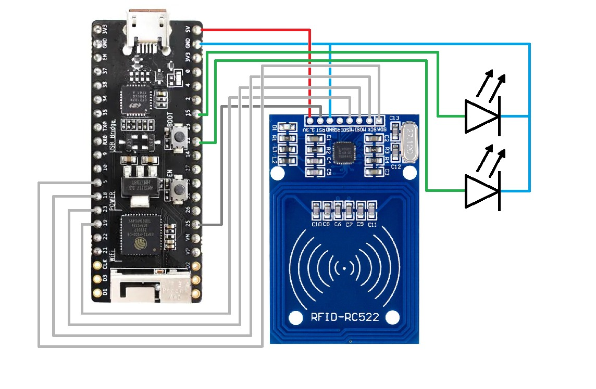
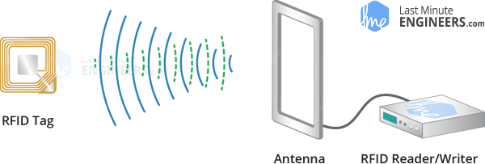
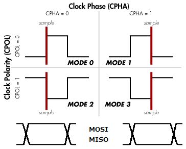
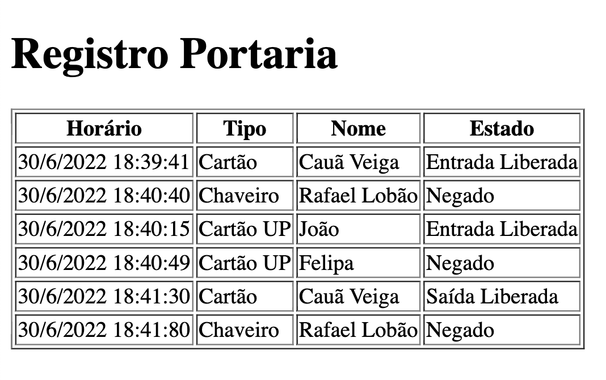

# Interface com o leitor de RFID RC522
## Cauã Veiga, Rafael Lobão
## Faculdade de Engenharia da Universidade do Porto

# 1. Introdução

Desenvolveu-se, no contexto da cadeira de Eletrónica Digital e Microprocessadores, uma interface que emprega um leitor de identificação por rádio frequência (RFID).

Neste projeto, idealizou-se uma situação em que uma empresa possui uma sala de acesso restrito. O acesso a esta sala é garantido sempre que o cartão de um funcionário autorizado é detetado pelo leitor.

Todos os acessos garantidos são registados num website e, no caso de um funcionário não autorizado tentar ter acesso à sala, algumas pessoas previamente definidas recebem um e-mail de notificação da ocorrência

# 2. Material

Neste projeto, usou-se o seguinte material: 

- placa de desenvolvimento;

- leitor de RFID RC522;

- Led vermelho e led verde;

- Cartões RFID;

## 2.1. RFID RC522 

Especificações:

- Consumo: 13-26mA / DC 3.3V;

- Consumo em Stand-By: 10-13mA / 3.3V;

- Consumo em Sleep: - Pico de corrente: <30mA;

- Frequência da operação: 13,56MHz;

- Tipos de cartões suportados: Mifare1 S50, S70 Mifare1, Mifare UltraLight, Mifare Pro, Mifare Desfire;

- Temperatura operacional: -20ºC a 80ºC;

- Taxa de transferência: 10 Mbit/s;

## 2.2. Esquema de montagem

<figure>

<figcaption align = "center"><b>Fig.2. Montagem utilizada.</b></figcaption>
</figure>

# 3. Descrição

# 3.1. Tecnologia *Radio Frequency IDentification*  <a href ='https://lastminuteengineers.com/how-rfid-works-rc522-arduino-tutorial/'>referencia</a>

Um sistema RFID consiste basicamente em dois componentes principais, um objeto contendo uma *tag* (o qual será identificado), e um *leitor* que irá ler esta *tag*.

O *leitor* consiste em um módulo de rádiofrequência e uma antena que gera um campo eletromagnético de alta frequência. Já a *tag* é um microchip que guarda e processa informações, e possui uma antena para receber e transmitir sinais. 

Quando a *tag* é aproximada ao *leitor*, o *leitor* gera um campo magnético e o chip responde transmitindo as suas informações para o leitor na forma de outro sinal de rádio, este processo é chamado *'retrodifusão'*. O *leitor* interpreta este sinal e manda os dados para o microcontrolador.
<figure>

<figcaption align = "center"><b>Fig.1 - Funcionamento sistema RFID.
 <a href ='https://lastminuteengineers.com/how-rfid-works-rc522-arduino-tutorial/'>lastminuteengineers.com</a></b></figcaption>
</figure>

## 3.2. Cadastro de objetos

Para a realização deste projeto foi fornecido um cartão e um chaveiro, ambos contendo *tag* RFID para se comunicarem com o leitor, para além disso, descobriu-se que os cartões de estudante UPorto funcionam com a mesma tecnologia e também podem ser usados. 

Cada tag possuí um *ID* único, permitindo então identificar esta *tag* a partir do seu *ID*, e no nosso caso, outras informações muito úteis para o funcionamento do sistema de segurança, como por exemplo se a passagem deste cartão é liberada ou negada.

Deste modo, criou-se uma rotina que, ao se aproximar do leitor uma *tag* não registrada, é permitido definir as seguintes características:

- Objeto (eg. Chaveiro, Cartão UP, ...);
- Nome do usuário;
- Estado (Liberado ou Negado);

Após isso essa informação é guardada em um arquivo *.json* de modo a ser utilizada posteriormente para reconhecer o objeto novamente.

## 3.2. Descrição do funcionamento da interface

A interface tem 3 comportamentos distintos:

### 3.2.1. Se o cartão tiver autorização de acesso

Ao entrar: o led verde pisca uma vez (simbolizando o desbloqueio da porta), o ID do cartão, o nome do proprietário, a hora de acesso e a informação "Entrada Liberada" são registadas na página Web.

Ao sair: o led verde pisca uma vez, o ID do cartão, o nome do proprietário, a hora de acesso e a informação "Saída Liberada" são registadas na página Web.

### 3.2.2. Se o cartão não tiver autorização de acesso

Uma notificação é enviada por e-mail a um grupo de pessoas pré-definidas com o ID do cartão, o nome do proprietário e a hora da tentativa de acesso. O mesmo é registado na página Web. Para além disto, o led vermelho pisca uma vez.

### 3.2.3. Se o ID do cartão não se encontrar registado

Prossegue-se ao cadastro da pessoa: O nome é introduzido, juntamente com o estatuto de acesso à sala. A interface pede um PIN secreto. Este PIN é definido no ficheiro "mysecrets.py". 

## 3.4. Comunicação do ESP32 com o leitor RFID
O RFID RC522 comunica com o ESP32 através do protocolo SPI. Esta comunicação é facilitada recorrendo a uma biblioteca de terceiros obtida em https://github.com/cefn/micropython-mfrc522. 

### 3.4.1. SPI 
SPI, do inglês Serial Peripheral Interface, é um protocolo de comunicação síncrona *full duplex*, de arquitetura *master/slave* que permite a comunicação entre o microcontrolador (master) e diversos componentes (slaves). 

O barramento deste protocolo possui quatro linhas de transmissão de dados:

- MOSI: transmite dados do Master para o Slave;
- MISO: transmite dados do Slave para o Master;
- SCLK: sinal de relógio;
- SS: define com qual slave o master pretende comunicar;

Quando se inicia este protocolo, é necessário definir os pinos para os sinais SCK, MOSI e MISO, a frequência de relógio a usar e os parâmetros *polarity* e *phase*.
A polaridade define que estado o sinal de relógio assume enquanto se encontra em repouso. A fase, por sua vez, define em que momento a informação é amostrada: na subida ou na descida do sinal de relógio.
A seguinte figura ajuda a perceber o conceito de polaridade e fase: 

<figure>

<figcaption align = "center"><b>Fig.2 - Modos SPI.
 <a href ='https://paginas.fe.up.pt/~hsm/docencia/edm/edm-2021-22/serial/'>Página EDM _ Hélio</a></b></figcaption>
</figure>

### 3.4.2. MFRC522
Esta biblioteca possui uma classe MFRC522 da qual se usou as seguintes funções:

- MFRC522(): cria um objeto dessa classe; 
- request(): retorna uma confirmação de que a leitura foi realizada com sucesso;
- anticoll(): retorna o ID do cartão lido juntamente com a confirmação de que a leitura foi realizada com sucesso;

## 3.5. Notificação por e-mail

Para as notificações, usa-se uma API configurada pelo serviço/website IFTTT ("If This Then That").
Este serviço permite automatizar certas ações: as ações são executadas sempre que há um "trigger". Neste caso, o trigger é uma solicitação feita com recurso à biblioteca "urequests" e envia um ficheiro json com o ID do cartão e o nome do proprietário.

O código foi baseado no artigo: https://microcontrollerslab.com/micropython-esp32-esp8266-send-sensor-readings-via-email-ifttt/.

## 3.6. Registro de acessos
De modo a gerir o histórico de acessos foi criada uma página web na qual é registrada em tempo real os acessos e tentativas de acessos realizadas. Para isso é gerado um HTML o qual é hosteado a partir do método sockets. 

Os dados registrados são do tipo, como mostrado na imagem (REFERENCIAR IMAGEM PRINT WEBSITE):

|  Horário  |  Tipo  |  Nome  |  Estado  |
|--------|----------|--------|----------|

Onde 'Horário' representa o horário e dia em qual o acesso ocorreu, com precisão de segundos. Para obter o horário atual foi usada a API *timeapi.io* através do método *urequest.get()*. 

<figure>

<figcaption align = "center"><b>Fig.3 - Exemplo website.
</figure>

# 4. Discussão/Conclusão/Coisas a melhorar/acrescentar

O objetivo proposto foi cumprido: implementou-se com sucesso uma interface com o leitor de RFID RC522o leitor de RFID RC522.

Como forma de complementar o projecto, empregou-se um sistema de notificações por e-mail e um sistema de registo de leituras.

Como forma de melhorar o projecto, podia-se ter implementado um "buzzer".

# 5. Referências

- https://www.electrofun.pt/comunicacao/leitor-rfid-arduino
- https://pt.wikipedia.org/wiki/Serial_Peripheral_Interface
- https://paginas.fe.up.pt/~hsm/docencia/edm/edm-2021-22/serial/
- https://github.com/cefn/micropython-mfrc522 

